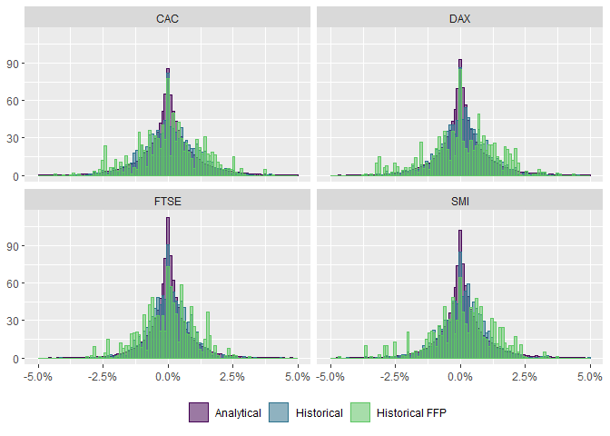

<!-- README.md is generated from README.Rmd. Please edit that file -->

# uncover

<!-- badges: start -->

[](https://lifecycle.r-lib.org/articles/stages.html#experimental)
[](https://github.com/Reckziegel/uncover/actions/workflows/R-CMD-check.yaml)

<!-- badges: end -->

The goal of `uncover` is to help users to perform the second step in
Meucci’s Checklist: **Estimation**.

## Installation

You can install the development version of `uncover` from
[GitHub](https://github.com/) with:

``` r
# install.packages("devtools")
devtools::install_github("Reckziegel/uncover")
```

## Usage

From **The Prayer**:

> “*…the estimation step is the process of fitting a distribution to
> both, the observed past realizations of the invariants, and
> (optionally) additional information that is available at the current
> time*
> …”

In `uncover` the “market” distribution can be estimated from historical
scenarios or through the analytical approach.

This brief introduction presents both.

``` r
# set up
library(tidyverse)
library(uncover)
library(ffp)

set.seed(123)

# invariants
x <- as_tibble(diff(log(EuStockMarkets)))
x
#> # A tibble: 1,859 x 4
#>         DAX      SMI       CAC      FTSE
#>       <dbl>    <dbl>     <dbl>     <dbl>
#>  1 -0.00933  0.00618 -0.0127    0.00677 
#>  2 -0.00442 -0.00588 -0.0187   -0.00489 
#>  3  0.00900  0.00327 -0.00578   0.00903 
#>  4 -0.00178  0.00148  0.00874   0.00577 
#>  5 -0.00468 -0.00893 -0.00512  -0.00723 
#>  6  0.0124   0.00674  0.0117    0.00852 
#>  7  0.00576  0.0122   0.0131    0.00821 
#>  8 -0.00287 -0.00359 -0.00194   0.000837
#>  9  0.00635  0.0110   0.000171 -0.00523 
#> 10  0.00118  0.00436  0.00313   0.0140  
#> # ... with 1,849 more rows
```

## Analytical Solution

Start with `reveal` to figure out which distribution presents the “best”
*in-sample* fit according to the AIC criteria:

``` r
reveal(x)
#> Currently fitting: asymmetric ghyp 
#> Currently fitting: asymmetric hyp 
#> Currently fitting: asymmetric NIG 
#> Currently fitting: asymmetric VG 
#> Currently fitting: asymmetric t 
#> Currently fitting: symmetric ghyp 
#> Currently fitting: symmetric hyp 
#> Currently fitting: symmetric NIG 
#> Currently fitting: symmetric VG 
#> Currently fitting: symmetric t 
#> Currently fitting: gauss
#> # A tibble: 11 x 8
#>    model symmetric lambda  alpha.bar     aic    llh converged n.iter
#>    <chr> <lgl>      <dbl>      <dbl>   <dbl>  <dbl> <lgl>      <dbl>
#>  1 ghyp  FALSE      0.655   4.29e-14 -56177. 28108. TRUE          39
#>  2 ghyp  TRUE       0.654   4.35e-13 -55847. 27940. TRUE          39
#>  3 VG    FALSE      0.655   0        -54375. 27207. TRUE          23
#>  4 VG    TRUE       0.654   0        -54369. 27200. TRUE          24
#>  5 hyp   TRUE       2.5     2.58e- 7 -52721. 26375. TRUE           9
#>  6 hyp   FALSE      2.5     9.00e- 8 -52715. 26376. TRUE          18
#>  7 t     TRUE      -3.08    0        -52711. 26371. TRUE          63
#>  8 t     FALSE     -3.10    0        -52711. 26375. TRUE          64
#>  9 NIG   FALSE     -0.5     1.87e+ 0 -52708. 26373. TRUE          37
#> 10 NIG   TRUE      -0.5     1.85e+ 0 -52708. 26369. TRUE          36
#> 11 gauss TRUE      NA     Inf        -52096. 26062. TRUE           0
```

In the current sample, the asymmetric Generalized Hyperbolic
Distribution (GHD) fits best. To model the GHP use `fit_ghp`:

``` r
fit <- fit_ghd(x)
fit
#> <list_of<double>[21]>
#> Converged:       TRUE
#> Dimension:       4
#> AIC:             -56176.6
#> Log-Likelihood:  28108.3
#> Model:           Asymmetric Generalized Hyperbolic
```

The family of functions `fit_*()` is available for different
distribution specifications, which include:

-   `fit_ghd`: for the [generalized hyperbolic
    distribution](https://en.wikipedia.org/wiki/Generalised_hyperbolic_distribution)
-   `fit_hyp`: for the [hyperbolic
    distribution](https://en.wikipedia.org/wiki/Hyperbolic_distribution)
-   `fit_nig`: for the [generalized inverse gaussian
    distribution](https://en.wikipedia.org/wiki/Generalized_inverse_Gaussian_distribution#:~:text=In%20probability%20theory%20and%20statistics%2C%20the%20generalized%20inverse,b%20%3E%200%20and%20p%20a%20real%20parameter.)
-   `fit_vg`: for the [variance gamma
    distribution](https://en.wikipedia.org/wiki/Variance-gamma_distribution#:~:text=The%20variance-gamma%20distribution%2C%20generalized%20Laplace%20distribution%20or%20Bessel,distribution%20decrease%20more%20slowly%20than%20the%20normal%20distribution.)
-   `fit_t`: for the [student-t
    distribution](https://en.wikipedia.org/wiki/Student%27s_t-distribution)
-   `fit_normal`: for the [normal
    distribution](https://en.wikipedia.org/wiki/Normal_distribution)

Once a target distribution is chosen, the randomness of the “market” can
be simulated in a large panel with `simulate_margins`:

``` r
dist <- simulate_margins(model = fit, n = 100000)
dist
#> # A tibble: 100,000 x 4
#>          DAX       SMI       CAC      FTSE
#>        <dbl>     <dbl>     <dbl>     <dbl>
#>  1 -0.00717  -0.000851 -0.00185  -0.00259 
#>  2 -0.00175   0.0117   -0.00482   0.00462 
#>  3  0.0198    0.0122    0.00129   0.00694 
#>  4  0.000638  0.000309 -0.00156  -0.00419 
#>  5  0.00144   0.00353  -0.00389  -0.00643 
#>  6  0.00310   0.00352   0.00259   0.00270 
#>  7  0.00306   0.00232   0.00420   0.00538 
#>  8 -0.00744  -0.00256  -0.00542   0.00260 
#>  9 -0.00108   0.000283 -0.000678 -0.000816
#> 10 -0.00360  -0.0172    0.00541  -0.00429 
#> # ... with 99,990 more rows
```

## Historical Scenarios

Historical scenarios play nice with the [Fully Flexible
Probabilities](https://reckziegel.github.io/FFP/). Bootstrapping can be
done very quickly in this approach:

``` r
# prior probabilities
p <- rep(1 / nrow(x), nrow(x))

boot <- bootstrap_scenarios(x = x, p = as_ffp(p), n = 100000)
boot
#> # A tibble: 100,000 x 4
#>          DAX        SMI        CAC      FTSE
#>        <dbl>      <dbl>      <dbl>     <dbl>
#>  1 -0.00448  -0.0138    -0.0207    -0.00926 
#>  2  0.00457   0.00214    0.00527    0.00504 
#>  3 -0.00378  -0.00551   -0.00924   -0.0116  
#>  4  0.00351   0.0000394 -0.00527    0.000658
#>  5  0.00184   0.00225   -0.00184    0.00248 
#>  6  0.00628  -0.00196   -0.000157   0       
#>  7  0.00341   0.00778   -0.00483    0.00149 
#>  8 -0.0253   -0.0138    -0.0296    -0.0121  
#>  9 -0.00485   0.00615   -0.000777   0.000958
#> 10 -0.000286 -0.00563    0.0000895 -0.00227 
#> # ... with 99,990 more rows
```

To “twick” the probability vector, use any of the functions avaiable in
the [ffp](https://reckziegel.github.io/FFP/) package.

Here, probabilities are modeled as an exponential decay, in order to
give more importance to recent events:

``` r
# Exponential Smoothing
probs <- exp_decay(x = x, lambda = 0.01)

boot_decay <- bootstrap_scenarios(x = x, p = probs, n = 100000)
boot_decay
#> # A tibble: 100,000 x 4
#>          DAX        SMI       CAC     FTSE
#>        <dbl>      <dbl>     <dbl>    <dbl>
#>  1 -0.000907  0.00113   -0.00202   0.00678
#>  2  0         0          0        -0.00560
#>  3  0.00738  -0.00374   -0.000622 -0.00135
#>  4 -0.0156    0.0000127 -0.0106   -0.00888
#>  5  0.00686   0.00940    0.0153    0.00496
#>  6  0.000395 -0.00426   -0.00162  -0.00409
#>  7  0.00406   0.00380    0.0173    0.00539
#>  8  0.00819  -0.00341    0.0174    0.00857
#>  9  0.00440  -0.00835    0.00159  -0.00540
#> 10 -0.0156    0.0000127 -0.0106   -0.00888
#> # ... with 99,990 more rows
```

For more details on flexible probabilities, please, refer to the
[ffp](https://reckziegel.github.io/FFP/) package and the papers bellow:

-   [Fully Flexible Views: Theory and
    Practice](https://papers.ssrn.com/sol3/papers.cfm?abstract_id=1213325)
-   [Historical Scenarios with Fully Flexible
    Probabilities](https://papers.ssrn.com/sol3/papers.cfm?abstract_id=1696802)

## Estimation Risk

From now on the “estimation risk” takes place which will have an impact
on the entire Checklist.

``` r
dist_tidy <- dist |> 
  pivot_longer(cols = everything()) |> 
  add_column(Type = "Analytical")
boot_tidy <- boot |> 
  pivot_longer(cols = everything()) |> 
  add_column(Type = "Historical")
exp_tidy <- boot_decay |> 
  pivot_longer(cols = everything()) |> 
  add_column(Type = "Historical FFP")

# plot
bind_rows(dist_tidy, boot_tidy, exp_tidy) |> 
  ggplot(aes(x = value, y = ..density.., color = Type, fill = Type)) + 
  geom_histogram(position = "identity", alpha = 0.5, bins = 100) + 
  facet_wrap(~name) + 
  scale_color_viridis_d(end = 0.75) + 
  scale_fill_viridis_d(end = 0.75) + 
  scale_x_continuous(labels = scales::percent_format(), limits = c(-0.05, 0.05)) +
  labs(x = NULL, y = NULL, color = NULL, fill = NULL) + 
  theme(legend.position = "bottom")
```



## Reference

-   Meucci, Attilio, ‘The Prayer’ Ten-Step Checklist for Advanced Risk
    and Portfolio Management (February 2, 2011). Available at SSRN:
    <https://ssrn.com/abstract=1753788> or
    <http://dx.doi.org/10.2139/ssrn.1753788>
